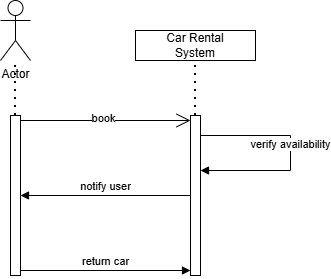
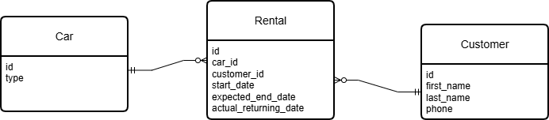

# Car Rental

A small Spring WebFlux-based simulation of a car rental reservation system.

Features
- Reserve a car of type Sedan, SUV or VAN for a given start date/time and number of days.
- Inventory limits per car type.
- Reactive controller and a simple in-memory inventory.

## High level design



## Model


Run tests

On Windows (cmd.exe) with Gradle installed:

```
gradle test
```

Or generate Gradle wrapper and use it locally:

```
gradle wrapper
 .\gradlew test
```

Build Docker image and run with compose:

```
.\gradlew bootJar
docker-compose up --build
```

API
POST /reservation
Body: JSON {"carType":"SEDAN","start":"2025-10-25T10:00:00","days":3}

Notes
- This project includes sample capacities (Sedan 3, SUV 2, Van 1) in the service constructor. Tests use a custom inventory to validate edge cases.

